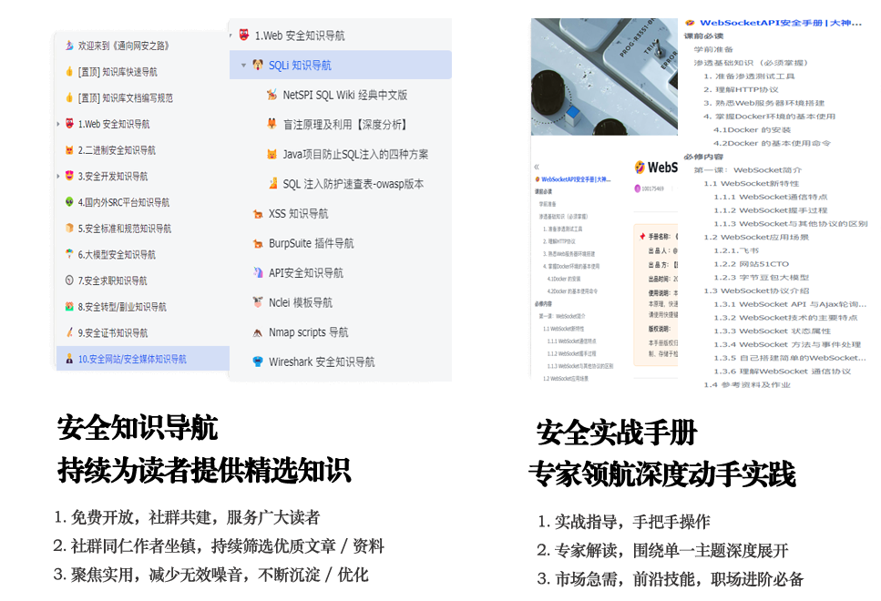

# waytosec.com已失效, 新域名：www.qingbaoya.com

欢迎来到知识导航库！我们旨在通过**知识整理**和**自动化收集技术**，**网罗互联网优质**的安全**公开资料**，为广大的网安从业者和安全爱好者，提供一个全面、系统的学习知识库（索引）。 

>快捷导航： [🤖 快速导航](https://q0vz8dcmr5i.feishu.cn/wiki/FD16wELnqiVTQRkFRHpccrYAnSc) \| [🧭 读者指南](https://q0vz8dcmr5i.feishu.cn/wiki/SyMzwccy6iK9smkOB1Hcn6C0ndh) \| [🚀 创作指南](https://q0vz8dcmr5i.feishu.cn/wiki/CmxzwJu8jif5wBkVZ76c2gM9nnh) \| 🧑🏻‍🎨 [社群共建](https://q0vz8dcmr5i.feishu.cn/share/base/form/shrcneHEumfowqRMhC2nwJ6i3Sc) \| [在线交流](https://q0vz8dcmr5i.feishu.cn/wiki/KEXLwa6v2i0eWPknHJGcgILyn1c)

> Tending knowledge is like gardening: weed to bloom. 
>知识整理，就像打理着花园，除去杂草，才能让花朵绽放光芒。 

## **1. WaytoSEC 是什么**

「通向网安之路」是一个网安知识整理服务，致力帮助网安爱好者摆脱信息洪流的干扰，聚焦和洞察那些真正有价值的内容。

目前，信息来源有两种整理模式：

-   **发掘模式**，由社群同仁日常收集和自动化挖掘，找到适合读者长期阅读且有持续价值的安全资料
-   **自荐模式**，由资料作者自己推荐，愿意把知识共享，获取广泛持续传播，申请共建后我们审核纳入知识导航

具体哪种方式，各位请不要纠结。我们尽力保证：让好的资料不被遗漏，让好的资料能被收纳。

如果你恰好不知道去哪里寻找网安学习资料，厌倦了零零碎碎东拼西凑的软文和广告，厌倦了辛苦下载半天却不能用的无力吐槽，那么你来「通向网安之路」试试吧！

[更多功能介绍请点此(opens new window)](https://q0vz8dcmr5i.feishu.cn/wiki/FD16wELnqiVTQRkFRHpccrYAnSc)

## **2. 我们为何做网安知识导航**

「通向网安之路」希望帮助10000名网安爱好者找到一份好用的安全资料，简单总结有如下三个方面：

-   希望帮忙那些自学网安的人，能通过快速找到可用的资料，直接从中获益
-   希望能降低筛选资料的门槛，网络资料很多，看花了眼，不知道哪些是真的可用，帮助大家节省大量时间来
-   希望帮助那些英文不好的同学，英文很多好资料，限于英文水平无法看懂，又没有对应的中文资料

总之，让网安的学习环境变得更好。仅这，我们想就足够了！

### **为何要做知识导航：**

10+年的工作经历，让我深刻地理解了知识整理的重要性。

**一、行业协同和认可**

通过整理行业资料库，可以大幅提升工作效率和工作成果。

具体来说，搭建资料库可以帮助我们快速收集、整理和提取相关信息。在日常工作中，一旦发现有价值的行业或业务资料，我们可以迅速归档到资料库中。当需要参考或应用这些信息时，也能快速找到并利用。

这些事情，一个人做完了，如果能分享出来，当其他人使用的时候就可以直接调用，无需再重复整理，这极大地提升了整个行业协同的效率，也加速行业对这个人的认可。

**二、个人发展**

作为个人，职场发展和个人成长同样离不开系统性整理和思考。而搭建行业资料库的过程，可以显著地提升个人成长速度，加深对行业知识的洞察。无论是在学习新知识还是取得新进步，通过持续收集、整理和复用，及时沉淀，不断充实知识库。这样一来，他的成长就不再是零散、无章的，而是有迹可循、螺旋上升的。

如果把一个人比作一个不断升级的系统，知识库则是他的外挂大脑。这两者相辅相成，共同促进，共同成长。

这是我们做知识导航的初衷，也希望你加入进来，成为社群同仁，携手共建「通向网安之路」！

### **申请成为社群同仁的门槛：**

我们相信，知识的价值在于分享与传递，安全的理念需要更多人的共同守护。

如果你想申请加入社群，我们希望是这样的你：

-   热爱网络安全，有持续学习和分享的热情
-   具备信息安全、系统安全、网络安全等相关领域的实践经验
-   能够定期投入时间，参与知识导航的建设和维护
-   擅长将复杂的安全概念转化为清晰易懂的内容
-   认同开源精神，愿意为社群贡献自己的一份力量

这不仅是一个知识导航的构建过程，更是一次彼此成就的交心之旅。如果你也认同这个理念，欢迎加入我们，让我们携手打造一个温暖而专业的网安知识社群。联系方式见下方链接，期待与这样的你相遇！

[点此填写社群同仁申请书(opens new window)](https://q0vz8dcmr5i.feishu.cn/share/base/form/shrcneHEumfowqRMhC2nwJ6i3Sc)

## **3. 作为读者，你能在此收获什么**

-   **高质量的学习环境：**我们的知识导航无大量的商业推广、无频繁的广告干扰、无诱导下载，为你打造纯粹的学习空间。所有内容均来源网络文章的提炼，让你能专注于知识本身；也可以通过附录的参考链接，直达原文。
-   **持续更新的优质内容：**我们承诺会根据市场变化，持续更新和吸纳高质量的网安新内容。你不仅能获取第一手的技术动态，还能参与内容共创，促进知识的良性循环。
-   **系统化的认知提升：**通过结构化的知识体系，帮助你建立完整的网安认知框架。我们不断整合和更新行业洞察，助你在这个快速发展的领域保持敏锐度。
-   **共同成长的学习社群：**在这里，你不只是一个读者，更是知识共同体的一员。你可以参与讨论、提出建议、分享经验，与志同道合者一起进步，让知识产生更大的价值。

这不仅是一个知识导航，更是一个让每个热爱网安的人都能持续成长的交流平台。

## **4. 作为同仁，你能在此收获什么**

将心比心，我们希望你能帮助社群创造出更优质的内容，也让你和更多读者建立紧密的关系。

【作为同仁，你将获得】

-   与行业专家深度交流、共同进步的机会
-   在实践中提升技术能力和文档编写能力
-   建立个人影响力，链接优质的同行资源
-   让你的专业知识帮助更多人，产生更大的社会价值

对于以下人士持保留态度，不鼓励他们加入我们的行列：

-   那些夸大宣传，恶意引流，实则提供与价值不符内容的人士（俗称“割韭菜”者）
-   那些来社群剽窃资料、传播不实信息、分发非法复制内容的人士
-   那些试图试探甚至挑战法律底线的人士

我们致力于打造一个正直、诚信的社群环境，上述行为是我们所不容的。

如果你还有更多想聊的，想说的，想问的，欢迎[和我们沟通](https://q0vz8dcmr5i.feishu.cn/share/base/form/shrcneHEumfowqRMhC2nwJ6i3Sc)

